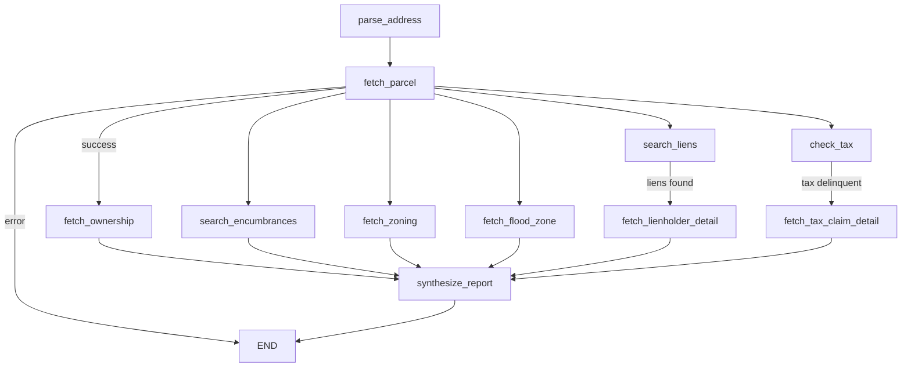

# TitleTrace

[](https://github.com/coreystevensdev/titletrace/actions/workflows/ci.yml)


Property title search as a LangGraph agent. Feed it a PA or NJ address; it fans out 6 parallel data lookups, conditionally drills into liens and tax delinquency, then synthesizes a structured title report via Claude.

```bash
docker compose up --build
curl -X POST localhost:8000/api/trace \
  -H 'Content-Type: application/json' \
  -d '{"address": "1234 Market St, Philadelphia, PA 19107"}'
```

## Problem

Title searches in PA and NJ require pulling data from four to six separate sources: parcel registries, lien databases, tax records, zoning classifications, and FEMA flood zone maps. A human title examiner checks each source manually and writes a narrative summary. The process takes hours and is error-prone when any single source returns stale data.

## Solution

A LangGraph state machine runs the lookups concurrently. Philadelphia properties route through the free OPA (Office of Property Assessment) and OpenDataPhilly APIs; all other PA and NJ properties use ATTOM Data. Flood zones come from FEMA NFHL's public ArcGIS REST endpoint (no key required). After the parallel fan-out completes, Claude synthesizes a structured `TraceReport` via forced tool call, surfacing data gaps explicitly rather than hallucinating over missing fields.

## Architecture



Claude is called only once, in `synthesize_report`, with a forced `submit_report` tool call. The model never sees raw address input or API credentials.

### Data source routing

| Coverage | Parcel + Owner | Tax | Liens | Zoning | Flood Zone |
|---|---|---|---|---|---|
| Philadelphia | OPA (free) | OPA (free) | ATTOM | ATTOM | FEMA NFHL (free) |
| PA (non-Philly) | ATTOM | not implemented in v1 | ATTOM | ATTOM | FEMA NFHL (free) |
| NJ | ATTOM | not implemented in v1 | ATTOM | ATTOM | FEMA NFHL (free) |

## Tech Stack

| Layer | Technology | Why |
|---|---|---|
| Agent framework | LangGraph 0.4 | Parallel Send API enables true concurrent fan-out across 6 data nodes; LangSmith traces every run |
| LLM | Claude via Anthropic SDK | Forced tool call (submit_report) guarantees structured output; model never sees raw PII |
| API | FastAPI + uvicorn | Async-native, Pydantic schema validation, auto-generated OpenAPI docs |
| HTTP | httpx.AsyncClient | Single shared connection pool across all 6 concurrent API calls; 30s timeout + exponential backoff on 429/503 |
| Data (Philadelphia) | OPA + OpenDataPhilly | Free Socrata endpoints, no key required; best parcel coverage for Philadelphia |
| Data (PA/NJ) | ATTOM Data API | Single vendor covering parcel, ownership, liens, encumbrances, and zoning across PA and NJ |
| Flood zone | FEMA NFHL ArcGIS REST | Public endpoint, no key, authoritative FIRM panel designation |
| Tests | pytest + respx | respx intercepts httpx at the client level so all API calls are mocked without touching the network |
| Packaging | hatchling | PEP 517 build, `pip install -e .` for local dev |

## Getting Started

Requires `ANTHROPIC_API_KEY`. ATTOM coverage requires `ATTOM_API_KEY` (200 free calls/month at api.attomdata.com).

```bash
cp .env.example .env
# edit .env with your keys
docker compose up --build
```

Or run without Docker:

```bash
pip install -e ".[dev]"
uvicorn titletrace.api.main:app --reload
```

API: `POST /api/trace` with `{"address": "123 Main St, Philadelphia, PA 19103"}`

Full OpenAPI schema at `localhost:8000/docs` when running.

## Tests

```bash
pip install -e ".[dev]"
pytest -v
```

Tests run without any API keys. Integration tests (requires live ATTOM key) are marked and skipped in CI:

```bash
INTEGRATION=true pytest -v -m integration
```

## Eval

Runs the full pipeline against 5 golden-dataset addresses and scores parse accuracy, parcel found rate, and error detection:

```bash
pip install -e ".[dev]"
python eval/eval.py
# results written to eval/results.json
```

Requires both API keys for non-error cases to score parcel_found_rate above 0%.

## Known Limitations

- Philadelphia is the only city with free tax-delinquency data. PA counties outside Philadelphia and all NJ properties have no tax-balance lookup in v1.
- FEMA flood zone lookup requires geocoded lat/lon. The current implementation returns `None` for flood zone on all addresses until a geocoding step is added.
- ATTOM free tier allows 200 calls/month. A single trace makes up to 5 ATTOM calls; the free tier supports ~40 traces/month before billing begins.
- LangGraph state merging in the parallel fan-out uses last-write-wins for scalar fields. If two nodes set the same key, the later-resolving node wins. List fields (liens, encumbrances, ownership_history) are each owned by exactly one node, so no collision occurs in practice.
- LangSmith tracing requires `LANGSMITH_API_KEY` and `LANGCHAIN_TRACING_V2=true`. Without it, traces are not persisted.
