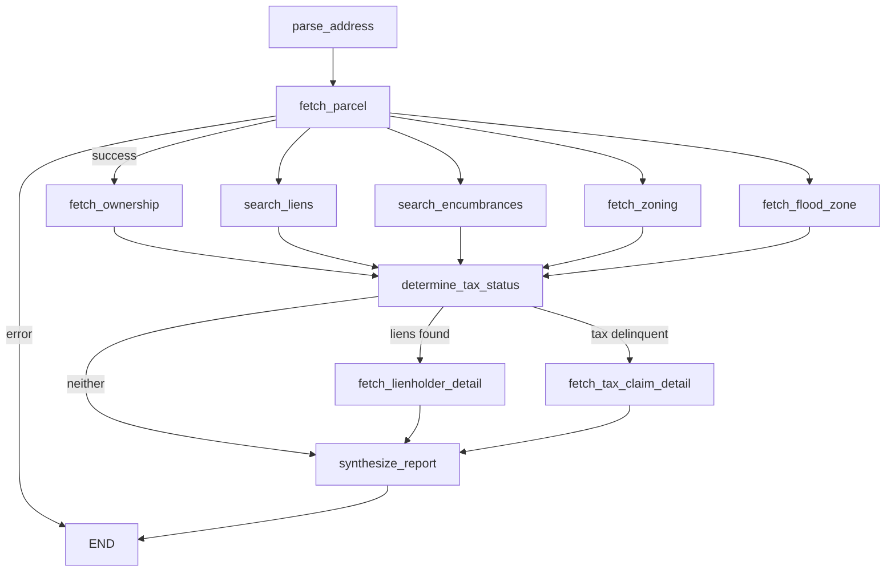

# TitleTrace

[](https://github.com/coreystevensdev/titletrace/actions/workflows/ci.yml)


Property title search as a LangGraph agent. Feed it a PA or NJ address; it fans out 5 parallel data lookups, determines tax status from the results, conditionally drills into lienholder detail and tax delinquency, then synthesizes a structured title report via Claude. 50 tests (pytest + respx).

```bash
docker compose up --build
curl -X POST localhost:8000/api/trace \
  -H 'Content-Type: application/json' \
  -d '{"address": "1234 Market St, Philadelphia, PA 19107"}'
```

## Problem

Title searches in PA and NJ require pulling data from four to six separate sources: parcel registries, lien databases, tax records, zoning classifications, and FEMA flood zone maps. A human title examiner checks each source manually and writes a narrative summary. The process takes hours and is error-prone when any single source returns stale data.

## Solution

A LangGraph state machine runs the lookups concurrently. Philadelphia properties route through the free OPA (Office of Property Assessment) and OpenDataPhilly APIs; all other PA and NJ properties use ATTOM Data. Flood zone comes from the FEMA NFHL client, called with the coordinates each parcel lookup now returns: ATTOM's `location.latitude`/`longitude` fields for non-Philadelphia PA and NJ parcels, and OPA's `lat`/`lng` fields for Philadelphia (see Known Limitations for the caveat on that second source). Tax delinquency outside Philadelphia is derived from ATTOM's lien records rather than left unimplemented, since ATTOM has no dedicated tax-status endpoint on its free tier. After the parallel fan-out completes, Claude synthesizes a structured `TraceReport` via forced tool call, surfacing data gaps explicitly rather than hallucinating over missing fields.

## Architecture



Claude is called only once, in `synthesize_report`, with a forced `submit_report` tool call. The model never sees raw address input or API credentials.

### Data source routing

| Coverage | Parcel + Owner | Tax | Liens | Zoning | Flood Zone |
|---|---|---|---|---|---|
| Philadelphia | OPA (free) | OPA (free) | ATTOM | ATTOM | FEMA NFHL, via OPA coordinates (unverified, see Known Limitations) |
| PA (non-Philly) | ATTOM | derived from ATTOM lien records | ATTOM | ATTOM | FEMA NFHL, via ATTOM coordinates |
| NJ | ATTOM | derived from ATTOM lien records | ATTOM | ATTOM | FEMA NFHL, via ATTOM coordinates |

## Tech Stack

| Layer | Technology | Why |
|---|---|---|
| Agent framework | LangGraph 0.4 | Parallel Send API enables true concurrent fan-out across 6 data nodes; LangSmith traces every run |
| LLM | Claude via Anthropic SDK | Forced tool call (submit_report) guarantees structured output; model never sees raw PII |
| API | FastAPI + uvicorn | Async-native, Pydantic schema validation, auto-generated OpenAPI docs |
| HTTP | httpx.AsyncClient | Single shared connection pool across all 6 concurrent API calls; 30s timeout + exponential backoff on 429/503 |
| Data (Philadelphia) | OPA + OpenDataPhilly | Free Socrata endpoints, no key required; best parcel coverage for Philadelphia |
| Data (PA/NJ) | ATTOM Data API | Single vendor covering parcel, ownership, liens, encumbrances, and zoning across PA and NJ |
| Flood zone | FEMA NFHL ArcGIS REST | Public endpoint, no key, authoritative FIRM panel designation. Queried with the coordinates returned by whichever parcel lookup ran (ATTOM or OPA) |
| Tests | pytest + respx | respx intercepts httpx at the client level so all API calls are mocked without touching the network |
| Packaging | hatchling | PEP 517 build, `pip install -e .` for local dev |

## Getting Started

Requires `ANTHROPIC_API_KEY`. ATTOM coverage requires `ATTOM_API_KEY` (200 free calls/month at api.attomdata.com).

```bash
cp .env.example .env
# edit .env with your keys
docker compose up --build
```

Or run without Docker:

```bash
pip install -e ".[dev]"
uvicorn titletrace.api.main:app --reload
```

API: `POST /api/trace` with `{"address": "123 Main St, Philadelphia, PA 19103"}`

Full OpenAPI schema at `localhost:8000/docs` when running.

## Tests

```bash
pip install -e ".[dev]"
pytest -v
```

All 50 tests run without any API keys; CI runs with `-m "not integration"`. The `integration` marker is registered in `pyproject.toml` for future tests against live ATTOM data -- none are written yet:

```bash
INTEGRATION=true pytest -v -m integration
```

## Eval

Runs the full pipeline against 5 golden-dataset addresses and scores parse accuracy, parcel found rate, and error detection:

```bash
pip install -e ".[dev]"
python eval/eval.py
# results written to eval/results.json
```

Requires both API keys for non-error cases to score parcel_found_rate above 0%.

## Known Limitations

- Philadelphia's flood-zone coordinates come from OPA's `lat`/`lng` fields, and that field-name assumption has never been confirmed against a live response: `data.phila.gov` returned HTTP 403 to the development sandbox's IP while this was being built. Non-Philadelphia coordinates come from ATTOM's `location.latitude`/`longitude` fields, which are documented and confirmed working.
- Non-Philadelphia tax delinquency is inferred from a recorded ATTOM tax lien rather than a dedicated tax-status field, since ATTOM's free tier doesn't expose one. A lien can take time to reach ATTOM's `/alllien/detail` index after a county records it, so a property can be delinquent at the tax office before this lookup reflects it -- the same recording-lag gap `fetch_tax_claim_detail_attom` already documents for its own lien-detail lookup.
- Only `fetch_parcel` catches vendor API errors. The other 8 graph nodes have no error handling: a timeout or non-2xx response from ATTOM, OPA, or FEMA during any of them crashes the whole trace instead of degrading to a partial report.
- Four separate node functions (`search_liens_attom`, `search_encumbrances_attom`, `fetch_lienholder_details_attom`, `fetch_tax_claim_detail_attom`) each call ATTOM's `/alllien/detail` endpoint independently per trace, which burns through the 200-calls/month free tier faster than a single shared fetch would.
- ATTOM free tier allows 200 calls/month. A single trace makes up to 5 ATTOM calls; the free tier supports ~40 traces/month before billing begins.
- LangGraph state merging in the parallel fan-out uses last-write-wins for scalar fields. If two nodes set the same key, the later-resolving node wins. List fields (liens, encumbrances, ownership_history) are each owned by exactly one node, so no collision occurs in practice.
- LangSmith tracing requires `LANGSMITH_API_KEY` and `LANGCHAIN_TRACING_V2=true`. Without it, traces are not persisted.
